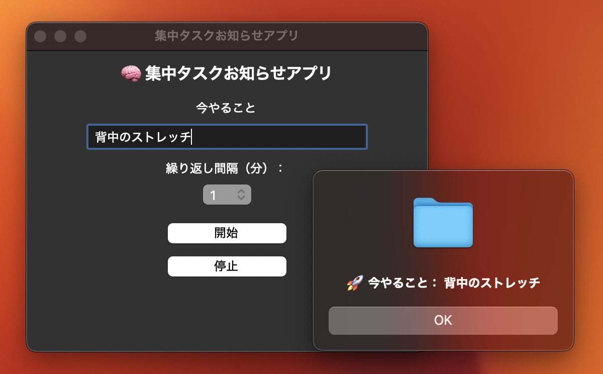

# 🔮 集中タスクお知らせアプリ (Focus Task Reminder GUI)

このアプリはPythonのTkinterを使って作成した、「自分のやるべき件を忘れずにリマインド」するための簡易グラフィカルアプリです。

---

## 🌐 機能概要

- 「今やること」を入力
- 繰り返し間隔(分) を選択
- タイマーを開始・停止
- 指定時間が経つとポップアップでメッセージを表示

---

## デモ



---

## 使用技術

- Python 3
- Tkinter (GUI)
- messagebox (ポップアップウィンドウ)
- after() メソッド (タイマー設定)

---

## 開始方法

### 必須:
- Python 3.x が安装されていること

### 実行:
```bash
python main.py
```

---

## ファイル構成

focus_task_reminder_gui/
├── main.py
├── README.md
└── images/
    └── demo_screenshot.png

---

## 導入文 (概要)

これは、フォーカス力を高めたい人や、忘れっぽい人のための、簡単なストレスリマインダーです。

記事の写作、ストレッチの練習、試験勉強、もしくは体操のスタートスイッチなどに使えます。

---

## 作成者

久保田 諳名（Kubota Anna）  

---

## 未来の拡張案

- [ ] ボタンの色カスタマイズ
- [ ] アイコン追加
- [ ] GUIのテーマ変更
- [ ] 音で通知する機能

---

## ライセンス

このプロジェクトはMITライセンスのもとで公開されています。

---

